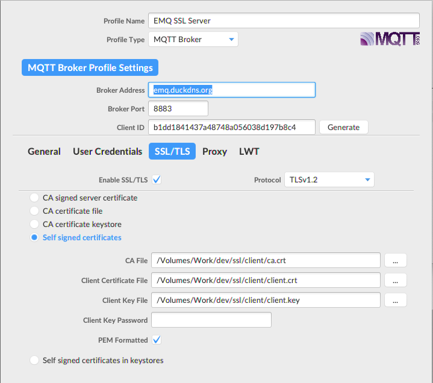

# User guide - How to create SSL Self-Certificates

## Theory

In cryptography, a certificate authority or certification authority (CA) is an entity that issues digital certificates. A digital certificate certifies the ownership of a public key by the named subject of the certificate. This allows others (relying parties) to rely upon signatures or on assertions made about the private key that corresponds to the certified public key. A CA acts as a trusted third party—trusted both by the subject (owner) of the certificate and by the party relying upon the certificate. The format of these certificates is specified by the X.509 standard.

--> As we are going to use self-certificate certs, CA certs is created by ourself and we use CA cert to sign both server and client public keys and generate client and server certificates.

## Step 1: Create CA key and CA certificate

Purpose: we are going to create CA private key and CA certificate.

### 1.1. Create CA key

Fist, CA private key with password protected -- this will be asked everytime you use CA to sign the client, server certificate request (csr).

```
$ openssl genrsa -des3 -out ca.key 2048
```

Output of above cmd:

```
$ openssl genrsa -des3 -out ca.key 2048
Generating RSA private key, 2048 bit long modulus
........................................+++
....................+++
e is 65537 (0x10001)
Enter pass phrase for ca.key:
Verifying - Enter pass phrase for ca.key:
```

### 1.2. Create CA certificate

Purpose of CA Certificate: each client, server can validate their digital SSL certificate which is signed by CA private key is correct. This file needs to be copied to both client, server sides.

```
openssl req -new -x509 -days 1826 -key ca.key -out ca.crt
```

Note: Common Name should be the server that client is connected to. In this case, `emq.duckdns.org`.

```
 openssl req -new -x509 -days 1826 -key ca.key -out ca.crt
Enter pass phrase for ca.key:
You are about to be asked to enter information that will be incorporated
into your certificate request.
What you are about to enter is what is called a Distinguished Name or a DN.
There are quite a few fields but you can leave some blank
For some fields there will be a default value,
If you enter '.', the field will be left blank.
-----
Country Name (2 letter code) []:VN   
State or Province Name (full name) []:Hanoi
Locality Name (eg, city) []:Hanoi
Organization Name (eg, company) []:Quectel Wireless Solutions
Organizational Unit Name (eg, section) []:FAE
Common Name (eg, fully qualified host name) []:emq.duckdns.org
Email Address []:ngohaibac@gmail.com
```

Output of above steps:

```
$ tree .
.
├── ca.crt
├── ca.key

```

## Step 2: Create private key, certificates

Purpose: for each client or server, below steps need to be done:
- Create private key
- Create certificate request: normally should send to CA 3rd-party to sign and get certifcate, however we are using our self-certifcate, so we will use our CA private to sign
- Create certificate: using CA private key (generated at step 1.1) to sign

### 2.1. Create client key, certificate request and certificate

Create client key, output is `client.key`

```
# openssl genrsa -out client.key 2048
Generating RSA private key, 2048 bit long modulus
..........................+++
...............+++
e is 65537 (0x10001)
```

Then, create certificate request from client.key, output is: client.csr

```
$ openssl req -new -out client.csr -key client.key
You are about to be asked to enter information that will be incorporated
into your certificate request.
What you are about to enter is what is called a Distinguished Name or a DN.
There are quite a few fields but you can leave some blank
For some fields there will be a default value,
If you enter '.', the field will be left blank.
-----
Country Name (2 letter code) []:VN
State or Province Name (full name) []:Hanoi
Locality Name (eg, city) []:Hanoi
Organization Name (eg, company) []:Quectel Wireless Solution
Organizational Unit Name (eg, section) []:FAE
Common Name (eg, fully qualified host name) []:emq.duckdns.org                                 
Email Address []:ngohaibac@gmail.com

Please enter the following 'extra' attributes
to be sent with your certificate request
A challenge password []:
```

Note: Common Name -- should be the host that client connects to, and same as CA certificate common name -- `emq.duckdns.org`. 

Then, using CA private key to sign the CSR to generate client certirficate.

```
$ openssl x509 -req -in client.csr -CA ca.crt -CAkey ca.key -CAcreateserial -out client.crt -days 360
Signature ok
subject=/C=VN/ST=Hanoi/L=Hanoi/O=Quectel Wireless Solution/OU=FAE/CN=emq.duckdns.org/emailAddress=ngohaibac@gmail.com
Getting CA Private Key
Enter pass phrase for ca.key:
bacnh@iMac ssl % openssl genrsa -out server.key 2048
Generating RSA private key, 2048 bit long modulus
................+++
............................................................+++
e is 65537 (0x10001)
```

Output of above steps:

```
tree .
.
├── ca.crt
├── ca.key
├── ca.srl
├── client.crt
├── client.csr
└── client.key
```

### 2.2. Create server private key, certificate

The same method can be applied for server side, with below scripts:

```
$ openssl genrsa -out server.key 2048
$ openssl req -new -out server.csr -key server.key
$ openssl x509 -req -in server.csr -CA ca.crt -CAkey ca.key -CAcreateserial -out server.crt -days 360
```

Output of above steps:

```
 tree .
.
├── ca.crt
├── ca.key
├── ca.srl
├── client.crt
├── client.csr
├── client.key
├── server.crt
├── server.csr
└── server.key
```

### Step 3: Configure MQTT server

### EMQX server

EMQX, SSL listener is configured by default using below certs located under emqx/etc/certs

```
$ tree etc/certs
etc/certs
├── README
├── cacert.pem
├── cert.pem
├── client-cert.pem
├── client-key.pem
└── key.pem
```

Thus, just overwrite CA Certs, server key and server certificate to the certs folder and restart emqx.

```
ca.crt --> cacert.pem
server.key --> key.pem
server.crt --> cert.pem
```

### Mosquitto server

Copy files ca.crt, server.key, server.crt to Mosquitto certs folder, for example, /etc/mosquitto/certs/

```
port 8883

.... 
# capath
cafile =  /etc/mosquitto/certs/ca.crt

# Path to the PEM encoded server certificate.
certfile = /etc/mosquitto/certs/server.crt

# Path to the PEM encoded keyfile.
keyfile = /etc/mosquitto/certs/server.key

```
Then, restart mosquitto server.

## Step 4: Test with the server

### Test with MQTT.fx

Set the configuration for MQTT.fx as below.

- Broker Address: emq.duckdns.org
- Broker Port: 8883
- Client ID: press Generate to have random Client ID

Select: Enable SSL/TLS with protocol TLSv1.2 and choose Self signed certicates:
- CA file --> point to ca.crt
- Client Certificate File --> point to client.crt
- Client Key File --> point to client.key

Select PEM Formatted. 



### Test with EG91 MQTT

Pls refer to EG91 folder.
- EG91_SSL.ini - can be imported to QCOM tool
- EG901_SSL_2020.01.22.log - log tested with latest EG91 FW EG91EFBR06A06M4G_01.006.01.006


## MQTT Server information

Server: emq.duckdns.org
Port: 8883 for SSL, 18883 for Non SSL